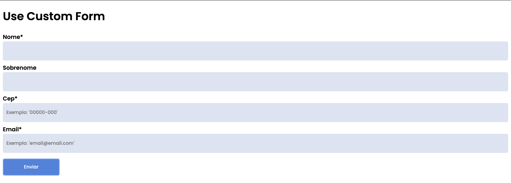
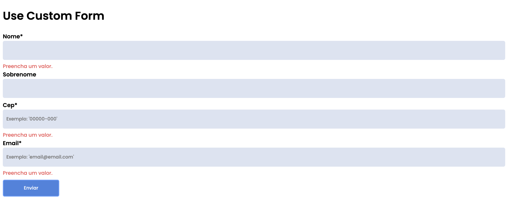
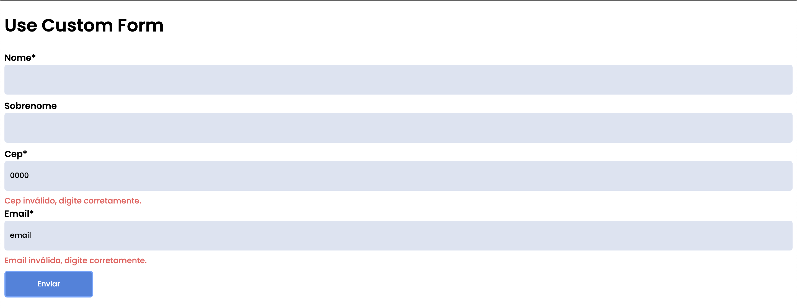

<h1>Custom Hook Forms</h1>
<h4>Formulário customizável utilizando Custom Hooks(useForm)</h4>

- Customização(standard) para uso livre.
- Formulário totalmente customizável e aplicável a diferentes contextos.
- Utilização de React Hooks, utilizando a opção customizável de Hooks(Custom Hooks).
- O projeto executa comandos em REGEX a partir das funções nas quais estão inseridos, e faz a verificação e validação de campos de formulários conforme caracterizados à partir dos objetos definidos no Hook 'useForm'.
- O objetivo é ter um formulário criado à partir das boas práticas de uso da biblioteca(React).
- A solução pode ser utilizada em qualquer projeto React.

<h4>Atenção</h4>

O foco do repositório não é demonstrar layout, ou um componente totalmente reaproveitável visualmente. Apesar de um layout amigável, é recomendável aplicar a customização CSS de acordo com a identidade visual do template de cada projeto no qual o componente será inserido.

<h3>Screenshots de Apresentação</h3>

<h6>Início / Campos de preenchimento obrigatório / Preenchimento inválido</h6>

